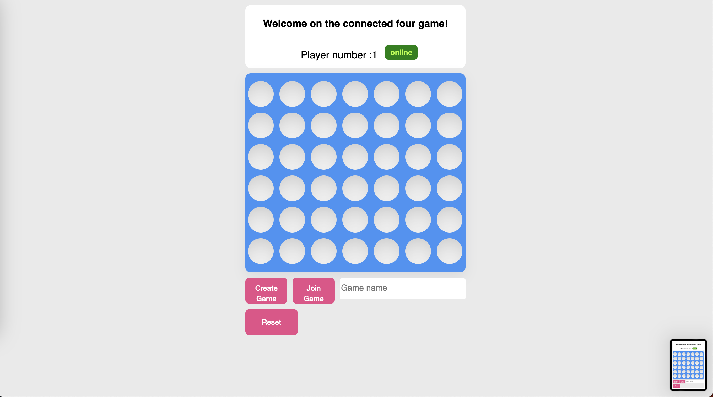

## Connected four Project

# Context
The app is build with two part, one front end in Angular 17 and one backend in Nodejs. 
The main library used to build the realTime behavior is socket.io
All the logical is in the backend service. 

# Installation
To install project, run this command on top of the project

`npm install `

# How to run Run
To run front and back app run this command on top of the project: 

`npm run start`

# View
